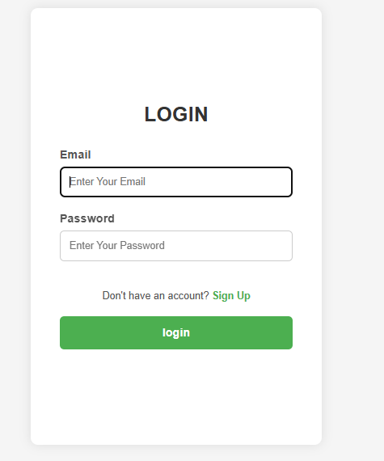
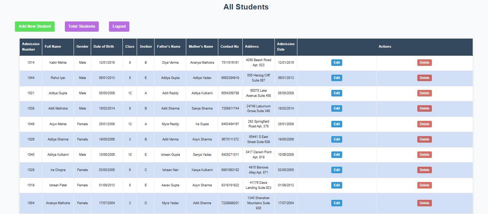
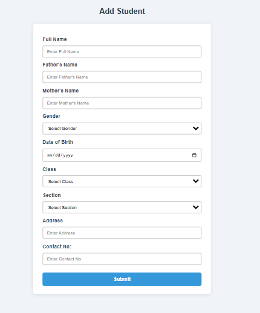
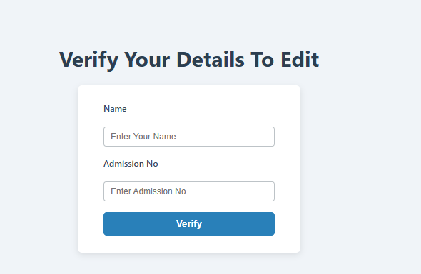

# 🎓 Student Management System

A full-stack Student Management System built using **Node.js**, **Express.js**, **EJS**, **MySQL**, and **CSS**. The application provides a simple and secure way for administrators to manage student records, including adding, viewing, editing, and deleting students.

The system features an authentication mechanism and an additional verification layer before sensitive actions such as editing or deleting student records.

---

## 📸 Screenshots

### Login Page




### Signup Page


### Student Dashboard



### Add Student Form



### Verification Before Delete


### Verification Before Edit




## ✨ Features

### 🔐 Authentication System

* Admin Signup
* Admin Login
* Credential Verification
* Restricted access to student management functionality

### 👨‍🎓 Student Management

* Add New Students
* View Student Records
* Edit Student Information
* Delete Student Records
* View Total Student Count

### 🛡️ Verification Layer

Before a student record can be edited or deleted, the administrator must verify:

* Student Full Name
* Admission Number

Only after successful verification is the operation allowed.

This adds an additional layer of protection against accidental modifications or deletions.

### 📋 Student Information Management

Each student record contains:

* Admission Number
* Full Name
* Gender
* Date of Birth
* Class
* Section
* Father's Name
* Mother's Name
* Contact Number
* Address
* Admission Date

### 🔄 Automatic Data Generation

The application automatically generates:

* Unique Student ID using UUID
* Admission Number using Faker.js

---

## 🛠️ Tech Stack

### Frontend

* HTML5
* CSS3
* EJS

### Backend

* Node.js
* Express.js

### Database

* MySQL

### Additional Packages

```json
{
  "@faker-js/faker": "^7.6.0",
  "ejs": "^3.1.10",
  "express": "^5.1.0",
  "express-session": "^1.18.2",
  "localtunnel": "^2.0.2",
  "method-override": "^3.0.0",
  "mysql2": "^3.14.3",
  "uuid": "^11.1.0"
}
```

---

## 📂 Project Structure

```text
Student-Management-System/
│
├── public/
│   ├── css
│   
│
├── views/
│   ├── signup.ejs
│   ├── login.ejs
│   ├── home.ejs
│   ├── show.ejs
│   ├── new.ejs
│   ├── edit.ejs
│   ├── edit_verify.ejs
│   └── delete_verify.ejs
│
├── index.js
├── package.json
└── README.md
```

---


## ▶️ Running the Project

Start the server:

```bash
node app.js
```

Server will run at:

```text
http://localhost:3000
```

---

## 📖 Application Workflow

### First Launch

When the application starts:

1. The system checks if an admin account exists.
2. If no account exists:

   * Signup page is displayed.
3. After signup:

   * Admin is redirected to Login.
4. Login is required before accessing student records.

---

### Add Student

1. Login as Admin.
2. Click **Add New Student**.
3. Fill student details.
4. Submit form.
5. Student is stored in MySQL database.

---

### Edit Student

1. Click **Edit**.
2. Enter:

   * Student Full Name
   * Admission Number
3. Verification succeeds.
4. Edit form becomes available.
5. Save changes.

---

### Delete Student

1. Click **Delete**.
2. Verify:

   * Student Full Name
   * Admission Number
3. Student record is permanently removed.

---

## 🎯 Concepts Implemented

* Express Routing
* RESTful CRUD Operations
* Server Side Rendering (SSR)
* EJS Templating
* MySQL Database Integration
* Form Handling
* Middleware
* Method Override (PATCH Requests)
* UUID Generation
* Faker.js Data Generation
* Authentication Workflow
* Verification Before Sensitive Operations

---

## 🔮 Future Improvements

* Password Hashing using bcrypt
* Session-Based Authentication
* Protected Routes Middleware
* Search Students
* Pagination
* Attendance Management
* Teacher Management Module
* Dashboard Analytics
* Export Data to Excel/PDF
* Cloud Deployment

---

## 👨‍💻 Author

**Abhijeet Jha**

Full-Stack Developer focused on building practical web applications using:

* JavaScript
* Node.js
* Express.js
* EJS
* MySQL

---

## Contributing

Contributions, suggestions, and feature requests are welcome.

If you'd like to contribute to this project, please open an issue or contact the repository owner before making major changes.

This project is maintained collaboratively, and significant modifications should be discussed with the maintainer beforehand.

